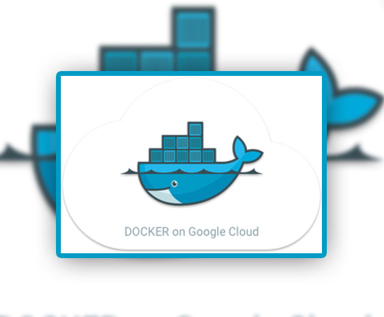

# Docker Containers


We'll use the official [WordPress](https://registry.hub.docker.com/_/wordpress/) Docker image for this installation. 
The WordPress docker image includes an Apache server. You can use any docker container you want however.

### Before you begin

[Follow the directions](https://cloud.google.com/container-engine/docs/before-you-begin) to:

* Enable the API.
* Install the `gcloud` and `kubectl` command line interfaces.
* Set your default project and Compute Engine zone.

We will be editing the following configuration files:

* `wordpress.yaml`: The WordPress pod configuration file.
* `wordpress-service.yaml`: The WordPress service configuration file.

```
gcloud container --project "my-test-load-balancing-project" clusters create "cluster-1" --zone "us-central1-a" \
  --machine-type "n1-standard-1" \
  --scope "https://www.googleapis.com/auth/compute","https://www.googleapis.com/auth/devstorage.read_only","https://www.googleapis.com/auth/logging.write","https://www.googleapis.com/auth/monitoring","https://www.googleapis.com/auth/servicecontrol","https://www.googleapis.com/auth/service.management" \
  --num-nodes "2" --network "network-1" --enable-cloud-logging --enable-cloud-monitoring

Creating cluster cluster-1...done.
Created [https://container.googleapis.com/v1/projects/my-test-load-balancing-project/zones/us-central1-a/clusters/cluster-1].

kubeconfig entry generated for cluster-1.
NAME       ZONE           MASTER_VERSION  MASTER_IP        MACHINE_TYPE   NODE_VERSION  NUM_NODES  STATUS
cluster-1  us-central1-a  1.3.2           104.198.224.238  n1-standard-1  1.3.2         2          RUNNING
```